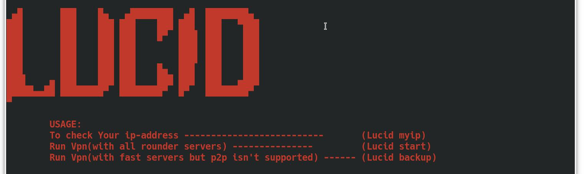
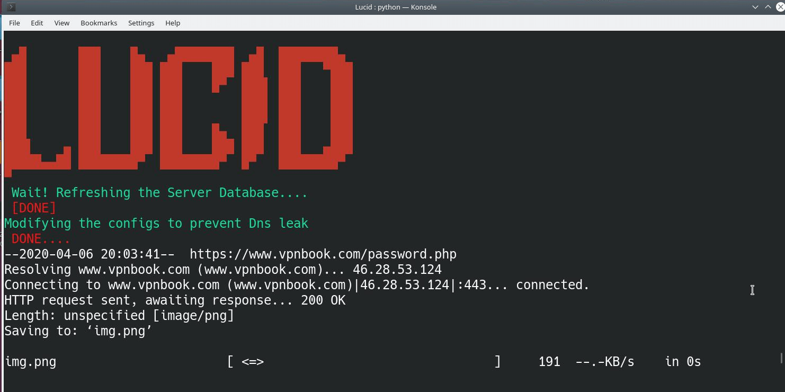
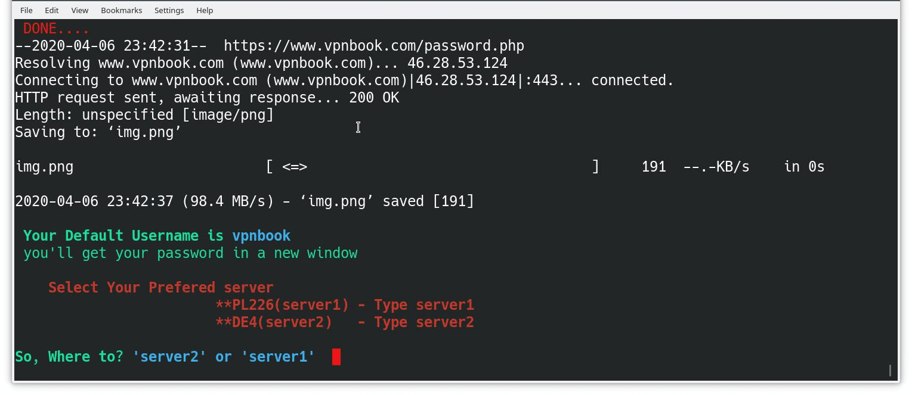
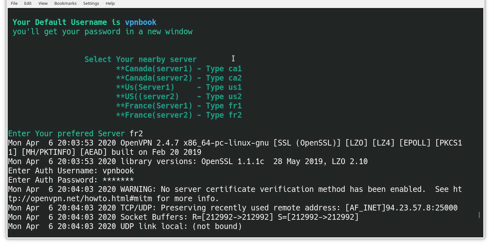

# Lucid
#### A cmd-line vpn client(utilizing Vpnbook servers and using OpenVpn as a wrapper.)

***Lucid fetches vpnbook servers and password and let ya connect.***

***The possible vpn leak is fixed by explicitly using the cloudflare Dns.***

#### How to install:

get inside the lucid directory and type in

```shell
sudo chmod +x installer.sh
sudo ./installer.sh
```

### Usage:

open up terminal and type in ``Lucid`` for usage.



type in `` Lucid start`` to use 'em servers that supports p2p downloading

Lucid'll attempt to download the latest configs and the password offcourse.




**Then select one of the servers by typing `` Lucid server1`` or `` Lucid server2`` as you prefer.**



### if you want faster servers but don't want p2p then type in ``Lucid backup`` and follow along.



